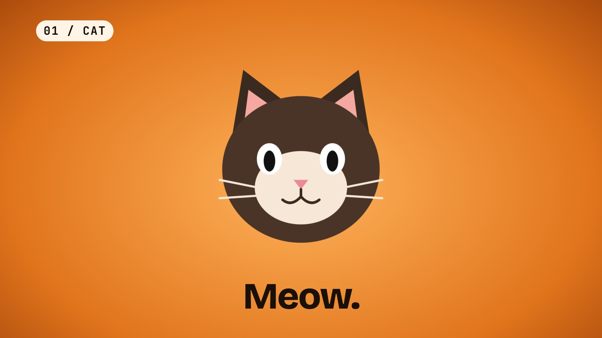

# 23 · Cat to dog: a 5-second transition



**Video:** [`final.mp4`](final.mp4) · 1920x1080 · 30 fps · 5.00 s · 2.2 MB · -14.0 LUFS

## The request

> "Create a short 5 sec video of transition video of cat and dog."

**Mode:** quick (no questions asked). Assumptions: a stylized animation drawn as inline SVG (no photos or
footage were supplied), a silent-friendly loop with a generated music bed and two sound effects, no voice.

## What it demonstrates

- **A whole video in one HTML file.** Two scenes, drawn with inline SVG and animated with CSS keyframes
  only, so the stage can seek to any frame and every frame renders on its own.
- **One shader handoff.** The cat scene hands off to the dog scene with the `morph-warp` WebGL transition
  (0.8 s), on the beat where the whoosh lands.
- **Generated sound.** `audio/mix.json` composes an `upbeat-tech` bed with two sections (intro, then a drop
  on the cut) and two synthesized effects, mastered to -14 LUFS. Nothing is downloaded.

## Commands

```bash
showtime new dom cat-dog-video --aspect 16:9 --duration 5 --title "Cat to Dog"
# replace index.html and audio/mix.json with the files in project/
showtime check cat-dog-video     # contrast failed once (white on orange): the text is now dark ink on a plate
showtime render cat-dog-video -o final.mp4
showtime snap cat-dog-video --at 1.2,2.7,3.8
```

## What the check found

`showtime check` failed the first version on contrast: white text on the orange scene measured 3.9:1
(needs 4.5:1). The captions became near-black ink and the small scene tag got a light plate behind it. The
re-run passed with 0 errors and 0 warnings.

## Sources

[`project/`](project/) holds `index.html`, `showtime.json` and `audio/mix.json`. The cat and the dog are
original drawings made for this example.
